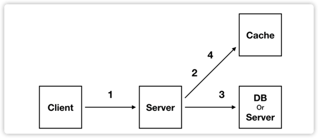

## 캐시(Cache)?

Cache란, 미리 저장해둬서 추후 요청할 결과를 빠르게 서비스를 해주는 것을 의미
- DB나 API Call을 하지 않고, 캐시로 접근하여 요청을 처리하게 됨
- 캐시처리에는 철학이 숨겨져 있다! (파레토 법칙)
    - 파레토 법칙 ?
        - 80%의 결과는 20%의 원인으로 발생한다는 의미.
        - 이는 캐시가 효율적일 수 있는 이유가 된다. 서비스를 할 때 많이 사용되는 20%를 캐싱하면 전체적으로 영향을 주어 효율을 극대화 할 수 있다.
    
캐시 사용 구조

1. 클라이언트가 요청
2. 캐시 작업
3. 실제 DB 작업
4. 다시 캐시 작업

---

어떻게 사용하냐에 따라서 `Lazy Cache`와 `Write Back` 으로 나뉨

> Lazy Cache
1. Cache에 Data 존재 유무 확인
2. Data가 있다면 Cache data 사용
3. Data가 없으면 실제 DB data를 사용하고 이 데이터를 Cache에 저장

> Write Back
1. Data를 캐시에 저장
2. 캐시에 있는 Data를 일정 기간동안 체크
3. 모여있는 Data들을 DB에 저장
4. Cache에 있는 데이터 삭제

- 여기서 `Write Back`이 참 신기하긴 하죠?
- DB는 접근 횟수가 적을수록 전체 시스템의 퍼포먼스가 좋아짐 (DISK I/O를 줄이는 것이 쿼리 튜닝의 핵심이기도 함)
- `Write Back`은 우선 데이터를 캐시에 모으고, 일정 주기동안 보관이 되었거나, 일정한 크기가 되었다면 한번에 DB로 처리하는 방식

## 레디스(Redis)

- Redis가 타 캐시 시스템(ex. MemCache)과 다른 특징은 다음과 같다.
1. Redis는 List, Set, Sorted, Hash 등과 같은 Collection을 지원한다.
2. Race condition에 빠질 수 있는 것을 방지한다.
    - Redis는 Single Thread이다.
    - 따라서 Atomic을 보장한다.
3. Persistence를 지원하여 서버가 꺼져도 다시 데이터를 불러올 수 있음

Redis 주요 사용처
- Remote Data Store
    - 여러 서버의 Data 공유를 위해 사용될 수 있음
    - 특히 레디스의 경우 싱글 스레드이므로 Race Condition 발생 가능성이 낮다는 것을 활용할 필요가 있을 경우 사용한다.
- 인증 토큰 개발시
- Ranking Board(Sorted SEt)
- 유저 API LIMIT
- Job Queue

