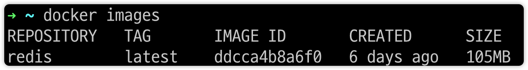

# What is Redis?
- Redis is an open-source, networked, in-memory, key-value data store with optional durability. It is written in ANSI C. 
- The development of Redis is sponsored by Redis Labs today; before that, it was sponsored by Pivotal and VMware. 
- According to the monthly ranking by DB-Engines.com, Redis is the most popular key-value store. 
- The name Redis means **RE**mote **DI**ctionary **S**erver.


> Redis 설치 : https://hub.docker.com/_/redis
```
docker pull redis
```

> start a redis instance
```
$ docker run --name some-redis -d redis
```



- 이미지를 받았기 때문에 바로 서버를 구동하면 되지만, redis-cli도 같이 구동하여 통신해야 하기 때문에 2개의 컨테이너를 실행할 것이며, 그 2개간 연결을 위해 docker network 구성을 먼저 할 것이

```
➜ ~ docker network create redis-net
d1b91e1d414d7ec9a7bf372f74d6df6559a70f7d09571623ab8b61493320121a
```

실행하기
```
➜ ~ docker run --name my-redis -p 6379:6379 --network redis-net -v ~/Desktop/redis:/data -d redis:latest redis-server --appendonly yes
c08639f332dddb0fee9c00fa4e45009675c27cf97497a8809c4951873a37edfa
```

- 여기서 -v 뒤에 있는 `~/Desktop/redis` 는 host와 연결할 폴더이고, 로컬 기준으로는 현재 컴퓨터의 디렉터리 중 고르면 된다.
- 실행되면 해당 폴더에 `appendonly.aof`라는 파일이 생김.


실행 확인
```
➜ ~ docker ps
CONTAINER ID   IMAGE          COMMAND                  CREATED         STATUS         PORTS                                       NAMES
c08639f332dd   redis:latest   "docker-entrypoint.s…"   2 minutes ago   Up 2 minutes   0.0.0.0:6379->6379/tcp, :::6379->6379/tcp   my-redis
```

redis-cli로 해당 redis server에 접속하기
```
➜ ~ docker run -it --network redis-net --rm redis:latest redis-cli -h my-redis
my-redis:6379>
```

여기서 --rm 옵션의 의미는 `실행할 때, 컨테이너 종료시에 컨테이너까지 같이 삭제함을 의미함` 

이제 다시 redis-net 네트워크 정보 조회해보기
```
➜ ~ docker network inspect redis-net
[
    {
        "Name": "redis-net",
        "Id": "d1b91e1d414d7ec9a7bf372f74d6df6559a70f7d09571623ab8b61493320121a",
        "Created": "2021-08-24T04:13:56.159258151Z",
        "Scope": "local",
        "Driver": "bridge",
        "EnableIPv6": false,
        "IPAM": {
            "Driver": "default",
            "Options": {},
            "Config": [
                {
                    "Subnet": "172.18.0.0/16",
                    "Gateway": "172.18.0.1"
                }
            ]
        },
        "Internal": false,
        "Attachable": false,
        "Ingress": false,
        "ConfigFrom": {
            "Network": ""
        },
        "ConfigOnly": false,
        "Containers": {
            "c08639f332dddb0fee9c00fa4e45009675c27cf97497a8809c4951873a37edfa": {
                "Name": "my-redis",
                "EndpointID": "ccb7aa33113363055ac63608f2a030e8cfaf8decfacb30236bc10a531daf3d47",
                "MacAddress": "02:42:ac:12:00:02",
                "IPv4Address": "172.18.0.2/16",
                "IPv6Address": ""
            }
        },
        "Options": {},
        "Labels": {}
    }
]
```
redis server의 ip 주소는 172.18.0.2 라는 것만 알고 넘어가면 된다.


- cli로 값을 직접 넣는 것은 byte 통신을 타지 않아서 바로 값이 보이는데,
- RedisTemplate를 이용하면 byte를 이용한 통신을 하기 때문에 값을 찾을 수 없는 현상이 있다.
  - 예를 들어서, redis-cli로 (key = abc, value = 123)을 넣고, RedisTemplate를 통해서 get(abc)를 해봤자 null이 나온다.
  - 왜냐하면 key 자체도 byte로 변환되어서 넘어가기 때문이다.
  - 그리고 클래스는 항상 Serialize 인터페이스를 구현해야 한다.


> RedisTemplate의 다양한 Operations

- opsForValue()
- ValueOperation (Strings, Value..)
- SetOperation (집합)
  - 합집합, 교집합, 차집합, 집합 내 값 존재 유무 등을 수행하는 메서드 제공
- 
